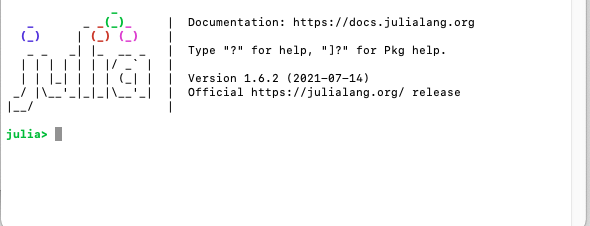

**Session 1: Julia installation and exploration**

- Objective: Successfully Explore Julia
- KR1: Julia can be run using the terminal, the Julia REPL appears
- KR2: Execute via the Julia REPL basic arithmetic expressions such as 2+3, or 3^4
- KR3: Tried several basic mathematical operations such as exponentiation, as well as known functions such as trigonometric and exponents.
- KR4: Switched to the four REPL modes (check the docs for these)
- KR5: Assign a generated ```30x30``` random matrix via the command ```rand()```
- KR6: Try out other basic *tricks* in one of the tutorial pages.


To install Julia, you just need to follow these steps:
1. Download Julia from their [website][1]. I downloaded v1.6.2 for macOS since I am using a macbook.
2. Follow the installation instructions (it was relatively simple).
3. After installing, you should be able to see something like this

4. I also installed a Julia extension for VSCode since I prefer using it when I am not using a terminal.


There are five (5) different types of REPL (read-eval-print loop) modes  in ```julia```. These are the (1) Julian mode, (2) Help mode, (3) Shell mode, (4) Pkg mode, and (5) Search mode.

### Julian mode
This mode is the most common and the default mode when you open Julia. In this mode, you can do basic mathematical operations and even has built-in functions (no more ```import numpy as np``` needed). Tab completion is also supported in Julia so yeay!

    julia> 8+5-4
    9

    julia> sin(90)
    0.8939966636005579

    julia> exp(5) 
    148.4131591025766

You can also create matrices directly in Julia!

    julia> rand(30,30)
    30×30 Matrix{Float64}:
    0.625157   0.626799   0.208533  0.609774    …  0.246494   0.717459  0.00200179  0.303835
    0.882573   0.929753   0.791787  0.645753       0.0525237  0.765403  0.814014    0.886829
    0.603399   0.0591102  0.372874  0.125569       0.296727   0.949615  0.277751    0.0038172
    0.163422   0.389737   0.968142  0.960986       0.316276   0.241735  0.329997    0.791104
    0.40597    0.728167   0.495392  0.106854       0.0514517  0.912296  0.938146    0.110506
    0.888555   0.446003   0.84296   0.54215     …  0.676585   0.394346  0.634977    0.23384
    0.97322    0.393525   0.990536  0.282594       0.739733   0.565528  0.980548    0.975289
    0.807375   0.101524   0.536107  0.495197       0.553152   0.374196  0.268339    0.769888
    0.420311   0.0739932  0.622597  0.400322       0.890403   0.489475  0.74426     0.563397
    0.703955   0.0701085  0.944065  0.261594       0.302889   0.455683  0.457311    0.292125
    0.709793   0.976002   0.702308  0.903417    …  0.0740916  0.496743  0.0385915   0.0233055
    0.961474   0.81423    0.781577  0.858057       0.755542   0.711822  0.365835    0.342773
    0.121277   0.108913   0.667993  0.125682       0.414388   0.161759  0.244736    0.913446
    ⋮                                           ⋱                                   
    0.892095   0.523108   0.251123  0.392353       0.539708   0.583973  0.0877653   0.437885
    0.331095   0.90931    0.465042  0.752356       0.695188   0.443269  0.746823    0.508422
    0.992549   0.70822    0.973259  0.00156787     0.364038   0.372436  0.431684    0.232122
    0.821286   0.890024   0.59946   0.198729    …  0.545485   0.557906  0.390939    0.315522
    0.25158    0.92457    0.935624  0.421808       0.1755     0.79278   0.828698    0.532608
    0.217661   0.156553   0.2281    0.537312       0.596257   0.277068  0.614843    0.945111
    0.650331   0.194834   0.410442  0.197671       0.183605   0.817441  0.437023    0.00878841
    0.544857   0.415732   0.332431  0.372686       0.66815    0.641433  0.304249    0.533133
    0.638285   0.512465   0.836963  0.646067    …  0.817569   0.744026  0.812138    0.173882
    0.0709032  0.733824   0.799983  0.998228       0.748394   0.979875  0.101945    0.793128
    0.543756   0.233423   0.88029   0.139229       0.668527   0.434151  0.49195     0.356231
    0.983532   0.835199   0.790692  0.726318       0.298218   0.152681  0.930122    0.0252579
    0.494333   0.988566   0.198158  0.665558       0.100271   0.180174  0.23059     0.53653


### Help mode
Help mode can be triggered by typing ```?```. This will change ```julia>``` to ```help>```. Help mode basically gives the documentation of a certain function or anything that you write after the question mark. For example, if we want to find out more about the exponential function, we just type ```? exp```

    help?> exp
    search: exp exp2 Expr expm1 exp10 export exponent expanduser ExponentialBackOff ldexp frexp nextpow

    exp(x)

    Compute the natural base exponential of x, in other words e^x.

    Examples
    ≡≡≡≡≡≡≡≡≡≡

    julia> exp(1.0)
    2.718281828459045

    ───────────────────────────────────────────────────────────────────────────────────────────────

    exp(A::AbstractMatrix)

    Compute the matrix exponential of A, defined by

    e^A = \sum_{n=0}^{\infty} \frac{A^n}{n!}.

    For symmetric or Hermitian A, an eigendecomposition (eigen) is used, otherwise the scaling and
    squaring algorithm (see [^H05]) is chosen.

    │ [^H05]
    │
    │  Nicholas J. Higham, "The squaring and scaling method for the matrix exponential
    │  revisited", SIAM Journal on Matrix Analysis and Applications, 26(4), 2005, 1179-1193.
    │  doi:10.1137/090768539 (https://doi.org/10.1137/090768539)

    Examples
    ≡≡≡≡≡≡≡≡≡≡

    julia> A = Matrix(1.0I, 2, 2)
    2×2 Matrix{Float64}:
    1.0  0.0
    0.0  1.0
    
    julia> exp(A)
    2×2 Matrix{Float64}:
    2.71828  0.0
    0.0      2.71828

### Shell mode
Shell mode can be activated using ```;```. In shell mode, you can use your system commands such as ```cd```, ```ls```, etc. To leave shell mode and go back to julian mode, you can just press backspace at the beginning of the line. I believe this only works for Linux and MacOS users. If you want to use shell mode in Windows, you first need to type ```powershell```.

### Pkg mode
To go to Pkg mode, just type ```]```. We can use this to install packages that will be useful for plotting, machine learning, etc. This [website][2] is a good website that basically lists most of the packages available in Julia and groups them in terms of their usage. These are just some of the packages that I installed:

    (@v1.6) pkg> status
        Status `~/.julia/environments/v1.6/Project.toml`
    [336ed68f] CSV v0.9.3
    [a93c6f00] DataFrames v1.2.2
    [7073ff75] IJulia v1.23.2
    [91a5bcdd] Plots v1.22.1

[1]: <https://julialang.org/downloads/> "Download Julia"
[2]: <https://juliapackages.com/> "Julia Packages"